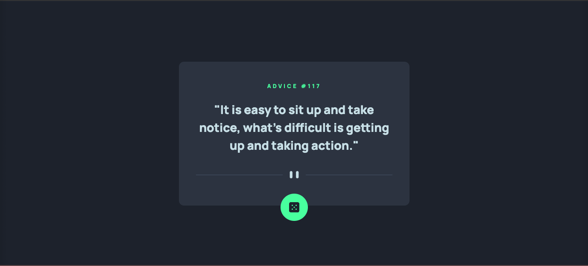
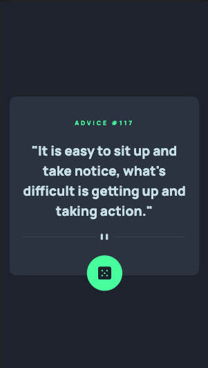

# Frontend Mentor - Advice Generator

This is a solution to the [Advice generator app](https://www.frontendmentor.io/challenges/advice-generator-app-QdUG-13db). Frontend Mentor challenges help you improve your coding skills by building realistic projects.

## Table of contents

-   [Overview](#overview)
    -   [Screenshot](#screenshot)
    -   [Links](#links)
-   [My process](#my-process)
    -   [Built with](#built-with)
    -   [What I learned](#what-i-learned)
-   [Author](#author)

## Overview

### Screenshot

**Desktop view**

**Mobile view**

### Links

-   [Solution](https://www.frontendmentor.io/solutions/advice-generator-ts-react-tailwindcss-Skqvcuuzc)
-   [Live Site](https://fluffy-biscochitos-6bce18.netlify.app/)

## My process

### Built with

-   Flexbox
-   Mobile-first workflow
-   [React](https://reactjs.org/)
-   [TailwindCSS](https://tailwindcss.com/) - Styling solution
-   [Vite](https://vitejs.dev/) - Bundler

### What I learned

Decided to go back to tailwind on this one, was pretty straight forward. Not so sure about what I learned, I think this was mostly about experimenting and trying to get it done quickly :D

-   Website - [Guilherme Oliveira](https://guis.me)
-   Frontend Mentor - [@guilhermehto](https://www.frontendmentor.io/profile/guilhermehto)
-   Twitter - [@teixol](https://www.twitter.com/teixol)
