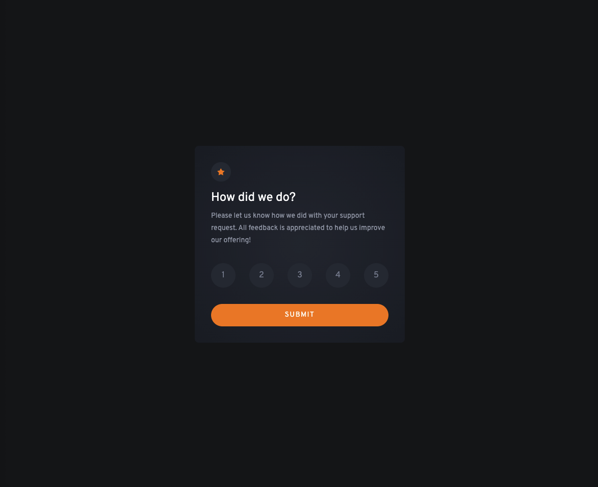

# Frontend Mentor - Interactive Rating Component

This is a solution to the [Interactive Rating Component](https://www.frontendmentor.io/challenges/interactive-rating-component-koxpeBUmI). Frontend Mentor challenges help you improve your coding skills by building realistic projects.

## Table of contents

-   [Overview](#overview)
    -   [Screenshot](#screenshot)
    -   [Links](#links)
-   [My process](#my-process)
    -   [Built with](#built-with)
    -   [What I learned](#what-i-learned)
-   [Author](#author)

## Overview

### Screenshot

**Desktop view**

**Mobile view**

### Links

-   [Solution](https://www.frontendmentor.io/challenges/interactive-rating-component-koxpeBUmI/hub/rating-component-reactts-vite-tailwindcss-vj5ITmKp5o)
-   [Live Site](https://comfy-kringle-65d91a.netlify.app/)

## My process

### Built with

-   Flexbox
-   Mobile-first workflow
-   [React](https://reactjs.org/)
-   [TailwindCSS](https://tailwindcss.com/) - Styling solution
-   [Vite](https://vitejs.dev/) - Bundler

### What I learned

Trying to get back on these, probably shouldn't have used margins in for positioning components inside the card, but just wanted to get it done quickly :p

-   Website - [Guilherme Oliveira](https://guis.me)
-   Frontend Mentor - [@guilhermehto](https://www.frontendmentor.io/profile/guilhermehto)
