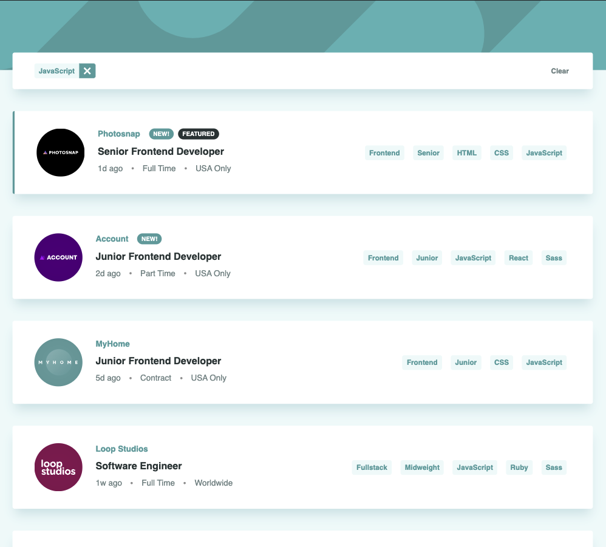
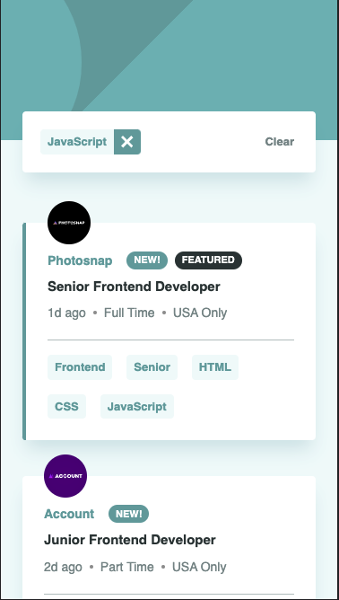

# Frontend Mentor - Job listings with filtering solution

This is a solution to the [Job listings with filtering challenge on Frontend Mentor](https://www.frontendmentor.io/challenges/job-listings-with-filtering-ivstIPCt). Frontend Mentor challenges help you improve your coding skills by building realistic projects.

## Table of contents

-   [Overview](#overview)
    -   [The challenge](#the-challenge)
    -   [Screenshot](#screenshot)
    -   [Links](#links)
-   [My process](#my-process)
    -   [Built with](#built-with)
    -   [What I learned](#what-i-learned)
    -   [Continued development](#continued-development)
    -   [Useful resources](#useful-resources)
-   [Author](#author)
-   [Acknowledgments](#acknowledgments)

## Overview

### The challenge

Users should be able to:

-   View the optimal layout for the site depending on their device's screen size
-   See hover states for all interactive elements on the page
-   Filter job listings based on the categories

### Screenshot

_Desktop:_

_Mobile:_

### Links

-   [Solution](https://github.com/guilhermehto/frontendmentor/tree/main/challenges/job-listings)
-   [Live site](https://vocal-piroshki-03bb4a.netlify.app/)

## My process

### Built with

-   Flexbox
-   Mobile-first workflow
-   [React](https://reactjs.org/)
-   [Vite](https://vitejs.dev/) - Bundler
-   [TailwindCSS](https://tailwindcss.com/) - Styling solution
-   TypeScript

### What I learned

Got better at using tailwind and configuring it, it's starting to feel like home. The Filter bar was probably the hardest thing to get right, but besides that it was mostly fun.

## Author

-   Website - [Guilherme Oliveira](https://guis.me)
-   Frontend Mentor - [@guilhermehto](https://www.frontendmentor.io/profile/guilhermehto)
-   Twitter - [@teixol](https://www.twitter.com/teixol)
