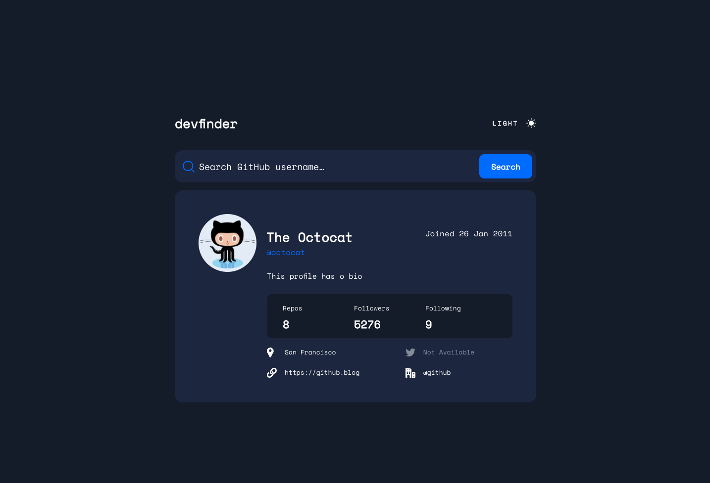
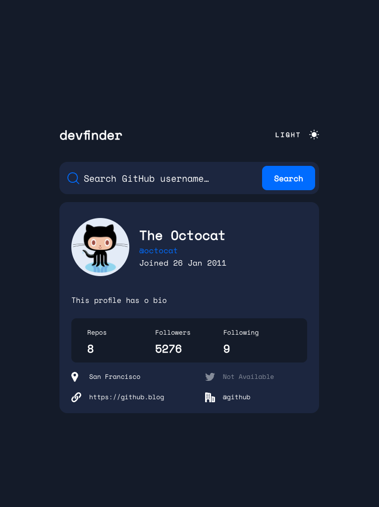
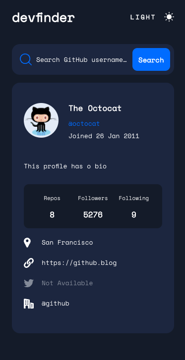

# Frontend Mentor - Time tracking dashboard solution

This is a solution to the [Time tracking dashboard challenge on Frontend Mentor](https://www.frontendmentor.io/challenges/time-tracking-dashboard-UIQ7167Jw). Frontend Mentor challenges help you improve your coding skills by building realistic projects.

## Table of contents

-   [Overview](#overview)
    -   [Screenshot](#screenshot)
    -   [Links](#links)
-   [My process](#my-process)
    -   [Built with](#built-with)
    -   [What I learned](#what-i-learned)
-   [Author](#author)

## Overview

### Screenshot

**Desktop view**

**Tablet view**

**Mobile view**

### Links

-   [Solution](https://www.frontendmentor.io/solutions/devfinder-w-styled-components-and-ts-lAEBxTZ6g)
-   [Live Site](https://loquacious-platypus-f80802.netlify.app/)

## My process

### Built with

-   Flexbox
-   Mobile-first workflow
-   [React](https://reactjs.org/)
-   [StyledComponents](https://styled-components.com/) - Styling solution
-   [Vite](https://vitejs.dev/) - Bundler

### What I learned

Soo, I developed this whole project using my custom nvim config. Got familiar with it and learned quite a bit about configuring vim during this.

Along with that, decided to try out StyledComponents. Don't think it plays that nice with TS tbh, but I liked it.

-   Website - [Guilherme Oliveira](https://guis.me)
-   Frontend Mentor - [@guilhermehto](https://www.frontendmentor.io/profile/guilhermehto)
-   Twitter - [@teixol](https://www.twitter.com/teixol)
