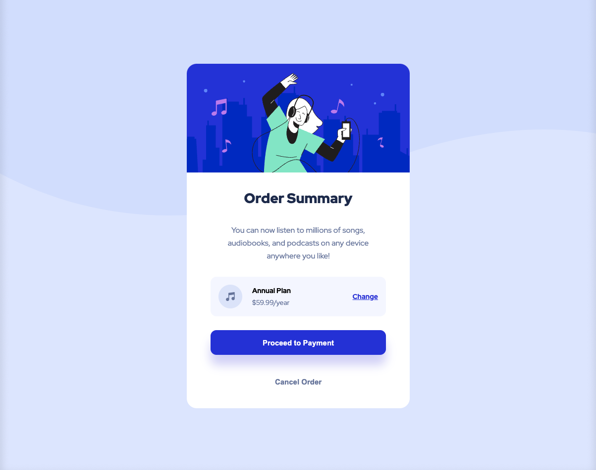

# Frontend Mentor - Order summary card solution

This is a solution to the [Order summary card challenge on Frontend Mentor](https://www.frontendmentor.io/challenges/order-summary-component-QlPmajDUj). Frontend Mentor challenges help you improve your coding skills by building realistic projects. 

## Table of contents

- [Overview](#overview)
  - [The challenge](#the-challenge)
  - [Screenshot](#screenshot)
  - [Links](#links)
- [My process](#my-process)
  - [Built with](#built-with)
  - [What I learned](#what-i-learned)

## Overview

### The challenge

Users should be able to:

- See hover states for interactive elements

### Screenshot

**Desktop**

**Mobile**

### Links

- [Solution URL](https://www.frontendmentor.io/solutions/order-summary-with-vite-ts-flexbox-react-w85EZE6gK)
- [Live URL](https://quizzical-minsky-6d4e93.netlify.app/)

## My process

### Built with

- React
- Typescript
- Flexbox
- Vite

### What I learned

This project was mostly used to solidify some stuff I learned previously. 
I also did not running into problems with the prod build was really nice as well.

