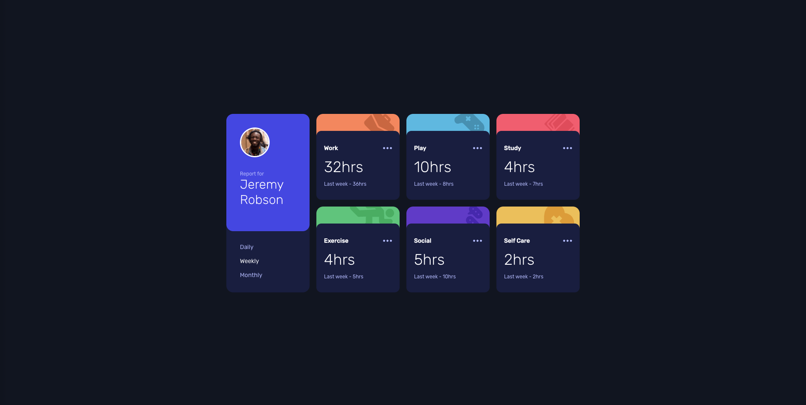
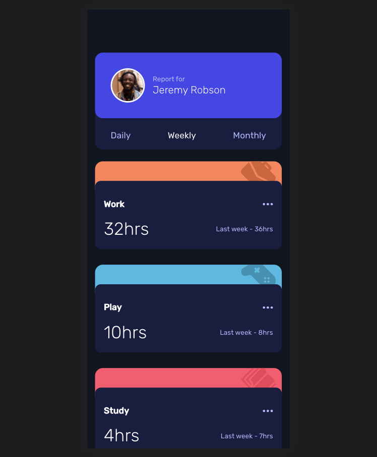

# Frontend Mentor - Time tracking dashboard solution

This is a solution to the [Time tracking dashboard challenge on Frontend Mentor](https://www.frontendmentor.io/challenges/time-tracking-dashboard-UIQ7167Jw). Frontend Mentor challenges help you improve your coding skills by building realistic projects.

## Table of contents

- [Overview](#overview)
  - [The challenge](#the-challenge)
  - [Screenshot](#screenshot)
  - [Links](#links)
- [My process](#my-process)
  - [Built with](#built-with)
  - [What I learned](#what-i-learned)
- [Author](#author)

## Overview

### The challenge

Users should be able to:

- View the optimal layout for the site depending on their device's screen size
- See hover states for all interactive elements on the page
- Switch between viewing Daily, Weekly, and Monthly stats

### Screenshot

**Desktop view**

**Mobile view**

### Links

- [Solution](https://your-solution-url.com)
- [Live Site](https://gifted-ritchie-54b984.netlify.app/)

## My process

### Built with

- Flexbox
- Mobile-first workflow
- [React](https://reactjs.org/)
- [Vite](https://vitejs.dev/) - Bundler

### What I learned

Vite is cool :) I intend on keep using it moving forward. Static asset handling on it is a bit annoying though.

- Website - [Guilherme Oliveira](https://guis.me)
- Frontend Mentor - [@guilhermehto](https://www.frontendmentor.io/profile/guilhermehto)
- Twitter - [@teixol](https://www.twitter.com/teixol)
